# n8n AI Agent Integration - Complete Setup Guide

## 🎯 Overview
The n8n integration enables an AI agent to monitor conversations, understand context, and proactively take actions (create calendar events, send emails, search the web, etc.). System messages from the agent appear in the chat UI with a 🤖 icon.

## ✅ Implementation Status

### **COMPLETED** ✓
- ✅ Client-side n8n webhook trigger (`client/utils/n8n.ts`)
- ✅ Non-blocking fire-and-forget pattern (30s timeout)
- ✅ Chat integration in `sendMessage()` function
- ✅ System message UI rendering (amber bubble with 🤖)
- ✅ API callback endpoint (`/api/n8n-callback`)
- ✅ Session ID generation (conversation-level context)
- ✅ Environment variable template
- ✅ Comprehensive system prompt document

### **PENDING** ⚠️
- ⚠️ Add `SUPABASE_SERVICE_ROLE_KEY` to `.env.local`
- ⚠️ Update n8n workflow configuration (see below)
- ⚠️ End-to-end testing

---

## 📋 Setup Steps

### Step 1: Get Supabase Service Role Key

1. Go to your Supabase Dashboard: https://supabase.com/dashboard/project/ypzpwjfddhnmuihnjhuo
2. Navigate to **Settings** > **API**
3. Copy the **`service_role`** key (NOT the `anon` key)
4. Open `client/.env.local` and replace `your_service_role_key_here` with your actual key:
   ```env
   SUPABASE_SERVICE_ROLE_KEY=eyJhbGc...your-actual-key-here
   ```

⚠️ **IMPORTANT**: The service role key bypasses Row Level Security. Keep it secret and NEVER commit it to git.

### Step 2: Restart Next.js Dev Server

```powershell
# Stop the current dev server (Ctrl+C if running)
# Then restart:
cd client
npm run dev
```

### Step 3: Update n8n Workflow

Your workflow URL: `https://n8n.lohokane.in/webhook/f440812b-e991-4ae5-ae53-35551cf021f6`

#### 3.1 Update Webhook Node

Configure the webhook to accept this payload structure:

```json
{
  "chatInput": "User's message text",
  "sessionId": "userId1:userId2",
  "senderId": "uuid-of-sender",
  "receiverId": "uuid-of-receiver",
  "messageId": "uuid-of-message",
  "timestamp": "2024-01-15T10:30:00Z"
}
```

**Key Points:**
- `sessionId` is the sorted user IDs joined with `:` (e.g., `user-123:user-456`)
- This ensures the AI agent has consistent conversation context regardless of who sends the message
- Use `sessionId` as the memory key for your AI agent node

#### 3.2 Update AI Agent System Prompt

Copy the content from `n8n-system-prompt.md` into your AI Agent node's system prompt. This includes:
- Role definition (conversation monitor and proactive assistant)
- Tool usage guidelines (Calendar, Email, Search, Date/Time)
- Conversational tone and confirmation patterns
- Example interactions

#### 3.3 Add Callback HTTP Request Node

After your "Respond to Webhook" or "AI Agent" node, add an **HTTP Request** node with these settings:

**Node Settings:**
- **Method**: POST
- **URL**: `http://localhost:3000/api/n8n-callback` (for dev) or `https://your-production-url.com/api/n8n-callback` (for prod)
- **Authentication**: None (Next.js API validates via service role key)
- **Send Body**: Yes (JSON)

**Body (JSON):**
```json
{
  "output": "{{ $json.output }}",
  "sessionId": "{{ $json.body.sessionId }}",
  "originalMessageId": "{{ $json.body.messageId }}"
}
```

**Important Notes:**
- `output`: The AI agent's response text (what to show in the chat)
- `sessionId`: Pass through from the webhook payload
- `originalMessageId`: The message ID that triggered the agent (for reference/debugging)

---

## 🔄 Message Flow

```mermaid
sequenceDiagram
    User->>Next.js: Send message
    Next.js->>Supabase: Insert message (realtime)
    Next.js->>n8n: Trigger webhook (non-blocking)
    Supabase->>All Clients: Realtime update
    n8n->>AI Agent: Process with context
    AI Agent->>Tools: Use Calendar/Email/Search
    n8n->>Next.js API: POST /api/n8n-callback
    Next.js API->>Supabase: Insert system message
    Supabase->>All Clients: System message appears with 🤖
```



### Flow Details:

1. **User sends message** in chat UI
2. **Message inserted to Supabase** → Realtime pushes to all connected clients
3. **n8n webhook triggered** in parallel (fire-and-forget, 30s timeout)
4. **n8n receives payload**:
   - `chatInput`: Message text
   - `sessionId`: Conversation ID (userId1:userId2)
   - `senderId`, `receiverId`: User IDs
   - `messageId`: Message UUID
   - `timestamp`: ISO 8601
5. **AI Agent processes** with full conversation context (memory keyed by sessionId)
6. **Agent may use tools**: Create calendar events, send emails, search web, get date/time
7. **n8n calls back** to Next.js API with agent's response
8. **API inserts system message** with `is_system: true`
9. **Realtime subscription** pushes system message to all clients
10. **UI displays** system message with 🤖 icon in amber bubble

---

## 🧪 Testing

### Test Case 1: Calendar Event Creation

1. Open chat with another user
2. Send message: **"Let's meet tomorrow at 7am to discuss the project"**
3. Expected behavior:
   - Message appears immediately in chat
   - Within ~5 seconds, system message appears: "✅ Created calendar event: Meeting on [date] at 7:00 AM"
   - Check your Google Calendar to confirm event was created

### Test Case 2: Web Search

1. Send message: **"What's the weather in San Francisco?"**
2. Expected behavior:
   - System message with weather info from SerpAPI

### Test Case 3: Email Sending

1. Send message: **"Email John at john@example.com about the meeting"**
2. Expected behavior:
   - System message: "✅ Email sent to john@example.com"
   - Check sent emails to confirm

### Debugging Commands:

```powershell
# Watch browser console for structured logs:
# [n8n] sending webhook...
# [n8n] response received
# [n8n] trigger failed (non-blocking): <error>

# Check n8n execution logs
# Check Next.js terminal for API callback logs:
# [api:n8n-callback] received payload
# [api:n8n-callback] inserted system message
```

---

## 🐛 Troubleshooting

### Issue: System messages not appearing

**Check:**
1. `SUPABASE_SERVICE_ROLE_KEY` is set correctly in `.env.local`
2. Next.js dev server was restarted after adding the key
3. n8n workflow has the HTTP Request callback node configured
4. Check browser console for `[n8n]` logs
5. Check Next.js terminal for `[api:n8n-callback]` logs

**Test the API directly:**
```powershell
curl -X POST http://localhost:3000/api/n8n-callback `
  -H "Content-Type: application/json" `
  -d '{"output":"Test system message","sessionId":"test-user-1:test-user-2","originalMessageId":"test-id"}'
```

### Issue: n8n webhook times out

**Check:**
1. n8n URL is correct in `.env.local`
2. n8n workflow is active (not paused)
3. Network allows outbound HTTPS to n8n.lohokane.in
4. Check browser console for `[n8n] trigger failed` logs

### Issue: Agent has no conversation context

**Check:**
1. `sessionId` is being used as the memory key in your AI Agent node
2. `sessionId` format is correct: `userId1:userId2` (sorted alphabetically)
3. AI Agent node has "Memory" enabled with key set to `{{ $json.body.sessionId }}`

---

## 🎨 UI Elements

### System Message Styling

System messages appear with:
- **Centered alignment** (not left/right like user messages)
- **Amber background** (`bg-amber-100` dark:`bg-amber-900/20`)
- **🤖 Icon** at the top
- **No sender name** (it's the AI agent)

Example appearance:
```
┌─────────────────────────────────────┐
│           🤖                        │
│  ✅ Created calendar event:         │
│  Meeting on Jan 15, 2024 at 7:00 AM│
└─────────────────────────────────────┘
```

---

## 📝 System Prompt Summary

The AI agent (see `n8n-system-prompt.md` for full version):

- **Monitors** all messages in a conversation
- **Understands context** from entire chat history
- **Takes proactive action** when appropriate
- **Confirms actions** in a conversational way
- **Uses tools**: Google Calendar, Gmail, SerpAPI, Date/Time utilities

Example behaviors:
- "meeting tomorrow at 7am" → Creates calendar event
- "what's the weather" → Searches web
- "email John about X" → Sends email
- "when is thanksgiving" → Uses date/time tool

---

## 🚀 Next Steps

1. ✅ Add service role key to `.env.local`
2. ✅ Restart Next.js dev server
3. ✅ Update n8n workflow (webhook payload, system prompt, callback node)
4. ✅ Test with a simple message: "meeting tomorrow at 7am"
5. ✅ Verify system message appears in UI
6. ✅ Iterate on system prompt based on agent behavior

---

## 🔒 Security Notes

- **Service Role Key**: Bypasses RLS, keep secret, never commit
- **API Callback**: No authentication required (validates internally)
- **n8n Webhook**: Public URL but validates payload structure
- **Rate Limiting**: Consider adding to API route if public

---

## 📚 Related Files

- `client/utils/n8n.ts` - Client-side webhook trigger
- `client/app/api/n8n-callback/route.ts` - Server-side callback handler
- `client/app/chat/page.tsx` - Chat UI with n8n integration
- `client/components/MessageBubble.tsx` - System message rendering
- `n8n-system-prompt.md` - AI agent prompt
- `.env.local.example` - Environment variable template

---

## 💡 Tips

- **Logs are your friend**: Check browser console and Next.js terminal
- **Start simple**: Test with basic calendar event creation first
- **Iterate on prompt**: Adjust system prompt based on agent behavior
- **Non-blocking**: n8n failures don't break chat (just logs a warning)
- **Conversation context**: sessionId ensures agent knows full chat history
